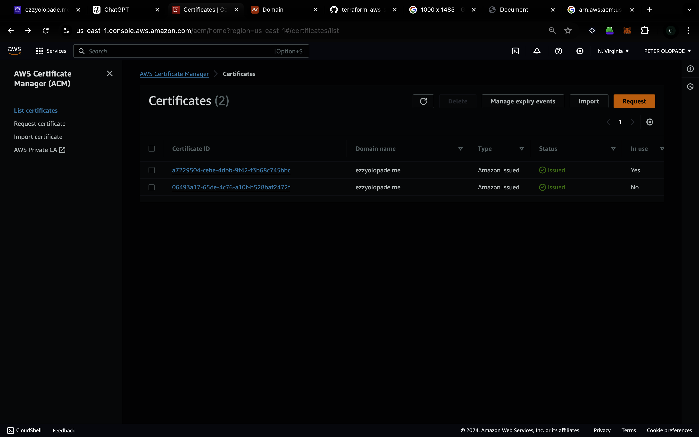

**DEPLOY A STATIC WEBSITE USING TERRAFORM**

This Terraform configuration defines resources for deploying a static website hosted on AWS S3:

1. **`aws_s3_bucket` "static_website"** : Creates an S3 bucket with the name provided by [`var.bucket_name`](vscode-file://vscode-app/Applications/Visual%20Studio%20Code.app/Contents/Resources/app/out/vs/code/electron-sandbox/workbench/workbench.html "modules/s3/variables.tf"). The `force_destroy` attribute is set to `true`, allowing Terraform to delete the bucket and all its contents when the Terraform resource is destroyed.
2. **`aws_s3_bucket_public_access_block` "block_access"** : Applies a public access block to the S3 bucket created above. It prevents public access to the bucket by blocking public ACLs and policies, ignoring public ACLs, and restricting public bucket access. This configuration is typically used to enhance security but would need to be adjusted or removed for a publicly accessible static website.
3. **`aws_s3_object` "webfiles"** : Uploads files to the S3 bucket. It uses the `fileset` function to find all files within the [`modules/s3/Ass2-Altschool`](vscode-file://vscode-app/Applications/Visual%20Studio%20Code.app/Contents/Resources/app/out/vs/code/electron-sandbox/workbench/workbench.html "/Users/raymond/Desktop/konrad assignment/modules/s3/Ass2-Altschool") directory and uploads each file to the bucket. The `key` is set to the file's path, making the file structure in S3 mirror that of the local directory. The `source` specifies the local file to upload. The `content_type` is incorrectly set to [`each.value`](vscode-file://vscode-app/Applications/Visual%20Studio%20Code.app/Contents/Resources/app/out/vs/code/electron-sandbox/workbench/workbench.html "modules/s3/s3.tf"), which represents the file path, not its MIME type; this should be corrected to reflect the actual content type of each file (e.g., `text/html` for HTML files).

**ROUTE53**

This Terraform snippet defines an `aws_route53_record` resource named `cert_validation` for DNS validation of a certificate. It dynamically creates DNS records based on the [`domain_validation_options`](vscode-file://vscode-app/Applications/Visual%20Studio%20Code.app/Contents/Resources/app/out/vs/code/electron-sandbox/workbench/workbench.html "modules/route53/variables.tf") variable, which is expected to be a list of objects containing domain validation information. Here's a breakdown of its components:

* **`for_each` Construction** : It iterates over [`var.domain_validation_options`](vscode-file://vscode-app/Applications/Visual%20Studio%20Code.app/Contents/Resources/app/out/vs/code/electron-sandbox/workbench/workbench.html "modules/route53/variables.tf"), a variable presumably containing domain validation options for an ACM (AWS Certificate Manager) certificate. For each item in this list, it maps `domain_name` to an object containing the DNS record's name, value, and type needed for validation.
* **`resource "aws_route53_record" "cert_validation"`** : This defines DNS records in AWS Route 53. Each record is created to fulfill the domain validation requirements for an ACM certificate. The records are used by AWS to verify that you control the domain names for which you're requesting the certificate.
* **`zone_id`** : Specifies the ID of the Route 53 hosted zone where the DNS records will be created. It references [`aws_route53_zone.main_route.zone_id`](vscode-file://vscode-app/Applications/Visual%20Studio%20Code.app/Contents/Resources/app/out/vs/code/electron-sandbox/workbench/workbench.html "modules/route53/route53.tf"), indicating that the hosted zone is defined elsewhere in the Terraform configuration under the resource name [`aws_route53_zone.main_route`](vscode-file://vscode-app/Applications/Visual%20Studio%20Code.app/Contents/Resources/app/out/vs/code/electron-sandbox/workbench/workbench.html "modules/route53/route53.tf").
* **`name`, `type`, `ttl`, `records`** : These attributes set the DNS record's name, type (e.g., CNAME), TTL (Time To Live), and the record values, respectively. The values for these attributes are derived from each item in the [`domain_validation_options`](vscode-file://vscode-app/Applications/Visual%20Studio%20Code.app/Contents/Resources/app/out/vs/code/electron-sandbox/workbench/workbench.html "modules/route53/variables.tf") variable, using the `for_each` loop to assign each record's specific configuration.

This setup is typically used in scenarios where you're automating the creation of ACM certificates that require DNS validation. Terraform dynamically creates the necessary DNS records based on the validation requirements provided by ACM, streamlining the certificate issuance process.

**CLOUDFRONT**

This Terraform configuration snippet defines two AWS resources related to Amazon CloudFront, a web service that speeds up distribution of your static and dynamic web content.

1. **CloudFront Distribution (`aws_cloudfront_distribution`)** : This resource configures a CloudFront distribution. Key configurations include:

* **`default_ttl` and `max_ttl`** : These settings control the default and maximum time-to-live for cache behaviors, determining how long content stays in the cache before CloudFront checks for a newer version.
* **`price_class`** : Set to "PriceClass_100", which specifies the lowest cost option that uses only edge locations in the United States, Canada, and Europe.
* **`restrictions`** : Configures geographic restrictions for the distribution. Here, `restriction_type` is set to "none", meaning there are no geo-restrictions and content is delivered globally.
* **`aliases`** : Specifies alternative domain names (CNAMEs) for the CloudFront distribution. It uses a variable [`var.domain_name`](vscode-file://vscode-app/Applications/Visual%20Studio%20Code.app/Contents/Resources/app/out/vs/code/electron-sandbox/workbench/workbench.html "modules/cloudfront/variables.tf") to dynamically set this value.
* **`viewer_certificate`** : Configures the SSL/TLS certificate and security policy for the distribution. It uses an ACM (AWS Certificate Manager) certificate specified by [`var.acm_certificate_arn`](vscode-file://vscode-app/Applications/Visual%20Studio%20Code.app/Contents/Resources/app/out/vs/code/electron-sandbox/workbench/workbench.html "modules/cloudfront/variables.tf"), enforces SNI (Server Name Indication) for SSL connections, and requires a minimum protocol version of TLS 1.2.

1. **CloudFront Origin Access Control (`aws_cloudfront_origin_access_control` "orgin_access")** : This resource creates an Origin Access Control (OAC) configuration named "first-cloud". OAC is used to restrict access to an S3 bucket (or any other origin) so that content can only be accessed via CloudFront, enhancing security. Key configurations include:

* **`origin_access_control_origin_type`** : Set to "s3", indicating the origin is an S3 bucket.
* **`signing_behavior`** : Configured to "always", meaning CloudFront will always sign requests to the origin.
* **`signing_protocol`** : Uses "sigv4", specifying AWS Signature Version 4 for signing requests, which is the current method for authenticating requests to AWS services.

Together, these configurations set up a CloudFront distribution that serves content from an S3 bucket (or other origins) with specific caching rules, a specified price class for cost control, no geographic restrictions, and a secure viewer connection using a specified SSL/TLS certificate. The Origin Access Control ensures that access to the origin is securely managed and controlled by CloudFront.

**CERTIFICATE**

This Terraform configuration defines resources for managing an AWS ACM (AWS Certificate Manager) certificate and its validation, specifically for a domain name provided as a variable. Here's a breakdown:

1. **AWS Provider Configuration** :

* Configures the AWS provider to use the `us-east-1` region. An alias is also set to `us-east-1`, allowing this specific provider configuration to be referenced in resources that need to be deployed in the `us-east-1` region.

1. **ACM Certificate Resource (`aws_acm_certificate.acm_cert`)** :

* This resource requests an SSL/TLS certificate from AWS Certificate Manager for the domain name specified in [`var.domain_name`](vscode-file://vscode-app/Applications/Visual%20Studio%20Code.app/Contents/Resources/app/out/vs/code/electron-sandbox/workbench/workbench.html "modules/certificate/variables.tf").
* The `validation_method` is set to `DNS`, meaning DNS records will be used to validate ownership of the domain.
* The `lifecycle` block with `create_before_destroy = true` ensures that a new certificate is created before the old one is destroyed during updates, minimizing downtime.

1. **ACM Certificate Validation Resource (`aws_acm_certificate_validation.acm_valid`)** :

* This resource is used to automate the validation of the ACM certificate. It depends on the ACM certificate resource defined above.
* It specifies the ARN (Amazon Resource Name) of the ACM certificate to be validated, using `aws_acm_certificate.acm_cert.arn`.
* The `validation_record_fqdns` parameter is expected to be a list of FQDNs (Fully Qualified Domain Names) that are used for DNS validation. This list is provided through the variable [`var.validation_record_fqdns`](vscode-file://vscode-app/Applications/Visual%20Studio%20Code.app/Contents/Resources/app/out/vs/code/electron-sandbox/workbench/workbench.html "modules/certificate/variables.tf").

This setup is commonly used to automate the provisioning and validation of SSL/TLS certificates for use with AWS services, such as Elastic Load Balancers, CloudFront distributions, and others that require certificates managed by ACM. The DNS validation method requires that specific DNS records be present in the domain's DNS configuration to prove control over the domain. This process is typically automated by Terraform when integrated with Route 53 or manually managed if using another DNS provider.

**main.tf**

This Terraform configuration orchestrates the deployment of a web infrastructure on AWS, involving several interconnected modules for managing SSL certificates, DNS records, CloudFront distribution, S3 buckets, and permissions. Here's a breakdown of its components:

1. **AWS Provider Configuration** :

* Specifies the AWS provider and sets the AWS region based on the [`var.region`](vscode-file://vscode-app/Applications/Visual%20Studio%20Code.app/Contents/Resources/app/out/vs/code/electron-sandbox/workbench/workbench.html "variable.tf") variable.

2. **Certificate Module** :

* Utilizes a custom module located in [`./modules/certificate`](vscode-file://vscode-app/Applications/Visual%20Studio%20Code.app/Contents/Resources/app/out/vs/code/electron-sandbox/workbench/workbench.html "/Users/raymond/Desktop/konrad assignment/modules/certificate") to manage an SSL/TLS certificate for the domain name specified by [`var.domain_name`](vscode-file://vscode-app/Applications/Visual%20Studio%20Code.app/Contents/Resources/app/out/vs/code/electron-sandbox/workbench/workbench.html "variable.tf").
* Receives DNS validation records from the [`route53`](vscode-file://vscode-app/Applications/Visual%20Studio%20Code.app/Contents/Resources/app/out/vs/code/electron-sandbox/workbench/workbench.html "main.tf") module to validate the certificate.
* **3.CloudFront Module** :
* Deploys a CloudFront distribution using settings from [`./modules/cloudfront`](vscode-file://vscode-app/Applications/Visual%20Studio%20Code.app/Contents/Resources/app/out/vs/code/electron-sandbox/workbench/workbench.html "/Users/raymond/Desktop/konrad assignment/modules/cloudfront").
* Configures the distribution to serve content from an S3 bucket, identified by `module.s3.bucket_domain_name` and `module.s3.bucket_name`.
* Uses the ACM certificate ARN provided by the `certificate` module for HTTPS.

4.**Permissions Module** :

* Manages permissions between CloudFront and the S3 bucket through [`./modules/permissions`](vscode-file://vscode-app/Applications/Visual%20Studio%20Code.app/Contents/Resources/app/out/vs/code/electron-sandbox/workbench/workbench.html "/Users/raymond/Desktop/konrad assignment/modules/permissions").
* Configures access using the CloudFront distribution ID, S3 bucket ARN, and bucket ID from the `cloudfront` and [`s3`](vscode-file://vscode-app/Applications/Visual%20Studio%20Code.app/Contents/Resources/app/out/vs/code/electron-sandbox/workbench/workbench.html "main.tf") modules, respectively.
* Utilizes the AWS account ID from [`data.aws_caller_identity.current.account_id`](vscode-file://vscode-app/Applications/Visual%20Studio%20Code.app/Contents/Resources/app/out/vs/code/electron-sandbox/workbench/workbench.html "main.tf") for permission settings.

5.**Route53 Module** :

* Configures DNS settings for the domain using [`./modules/route53`](vscode-file://vscode-app/Applications/Visual%20Studio%20Code.app/Contents/Resources/app/out/vs/code/electron-sandbox/workbench/workbench.html "/Users/raymond/Desktop/konrad assignment/modules/route53").
* Sets up DNS records to point the domain to the CloudFront distribution and handles the DNS validation for the SSL/TLS certificate.
* Uses domain name, CloudFront distribution details, and domain validation options from the `cloudfront` and `certificate` modules.
* **6. S3 Module** :
* Creates and configures an S3 bucket for website hosting with the name provided by [`var.bucket_name`](vscode-file://vscode-app/Applications/Visual%20Studio%20Code.app/Contents/Resources/app/out/vs/code/electron-sandbox/workbench/workbench.html "variable.tf"), using settings from [`./modules/s3`](vscode-file://vscode-app/Applications/Visual%20Studio%20Code.app/Contents/Resources/app/out/vs/code/electron-sandbox/workbench/workbench.html "/Users/raymond/Desktop/konrad assignment/modules/s3").

This configuration effectively sets up a static website hosted on an S3 bucket, served through a CloudFront distribution for improved performance and security, with an SSL/TLS certificate for HTTPS. DNS records managed by Route53 point the domain to the CloudFront distribution, and permissions are configured to allow CloudFront to access the S3 bucket content securely.

**FINAL RESULTS**

